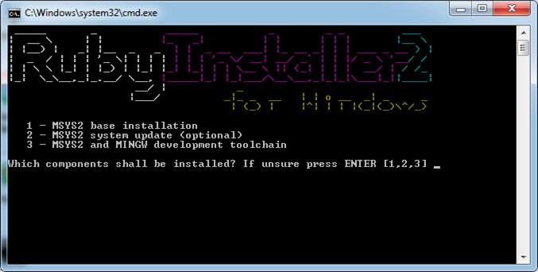
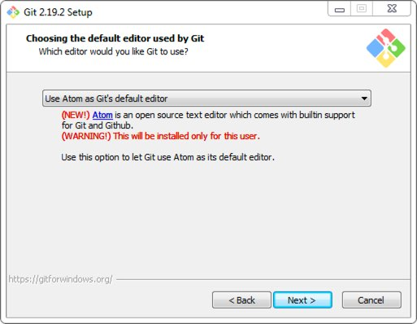
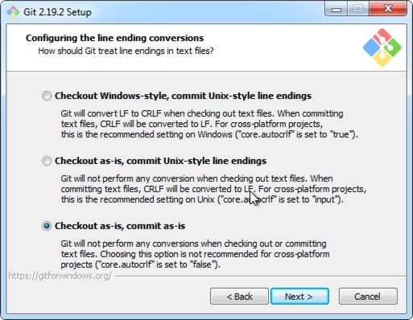

# RailsBridge for Windows

The official RailsBridge instructions are referencing some broken software packages. These are new instructions for going through the Windows page of Installfest at http://docs.railsbridge.org/installfest/windows. These instructions are meant to replace just the one Windows page, everything else should work as written.

These instructions should work for all versions of Windows from 7 to Windows 10.

You may need to log in as Administrator or give the Administrator password when installing some programs, depending on your Windows version and user settings.

Most newer versions of Windows will use **(x64)** downloads, if you're not sure please ask a volunteer.

### Ruby

Ruby is the programming language we'll use to code our web application.

Download and install **Ruby+Devkit 2.5.3-1** from RubyInstaller at https://rubyinstaller.org/downloads. 

Accept all defaults during the install.

Press **ENTER** when prompted for the final step in the popup command window. If it prompts again but says **succeeded** in green then close the window, it's done.



### Atom

Atom is the text editor we'll use to manipulate code files.

Download and install the latest Atom for Windows from https://atom.io. 

Accept all defaults during the install.

### Git

Git is a code versioning system that we'll use to keep track of changes to our code.

Download and install the latest Git for Windows from https://git-scm.com/download/win.

Accept all the defaults except for two steps:

On the *"Choosing the default editor used by Git"*, select **Atom**



On the *"Configuring the line ending conversions"* question choose the last option of **Checkout as-is, commit as-is**



### Heroku

Heroku is the server platform we'll use to host our web apps.

Download and install the latest Heroku CLI for Windows from https://devcenter.heroku.com/articles/heroku-cli. 

Accept all the defaults during the install.

### Ruby on Rails

Ruby on Rails is the framework, written in the Ruby programming language that we'll use to build our web application.

First, start a command prompt with Ruby support using **Start** -> **All Programs** -> **Ruby 2.4.5-1 with MSY2** ->  **Start Command Prompt with Ruby**

Install Ruby on Rails with:

``` shell
gem install rails --no-document
```

### Test App

The rest of the RailsBridge documentation should work as written.
